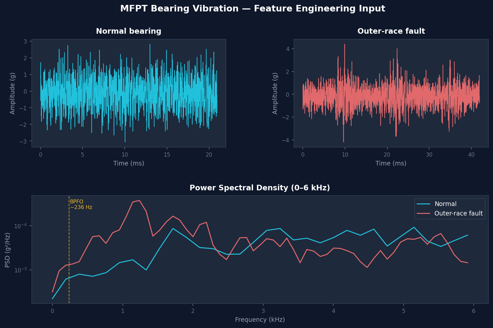
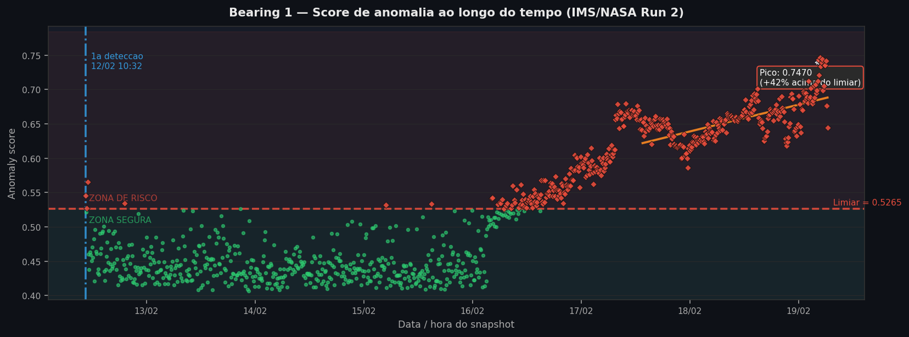
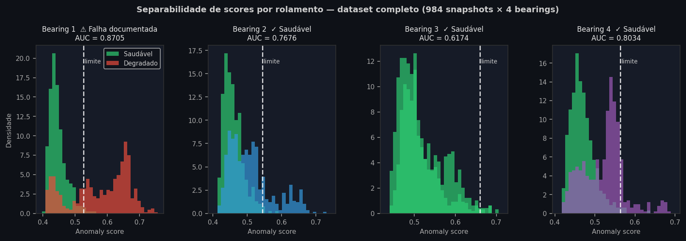
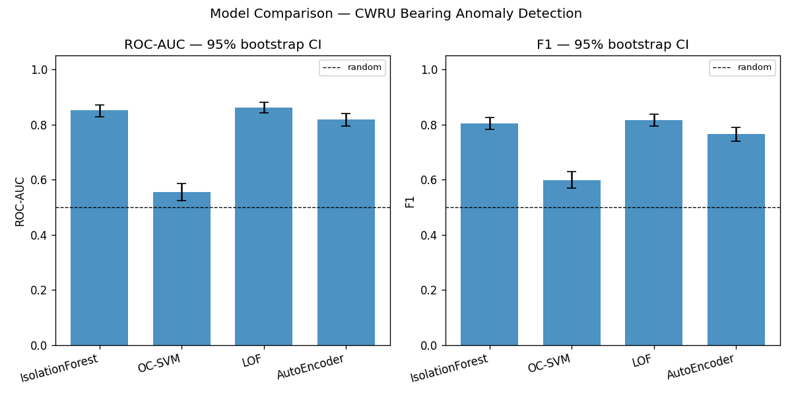
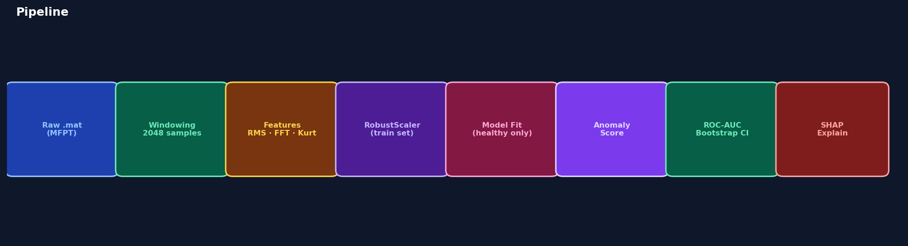

# industrial-anomaly-detection


**Detecção preditiva de falhas em rolamentos industriais com aprendizado não supervisionado.**

Modelos treinados **exclusivamente em dados saudáveis** — sem nenhum rótulo de falha — capazes de detectar degradação de rolamentos horas antes do colapso, com limiar calibrado por rolamento (≤ 1% de falsos alarmes por design).

> **Resultado principal — Bearing 1 (IMS/NASA Run 2):**
> AUC = **0.8705** (dataset completo) · Primeira detecção **47 horas antes** do fim do período monitorado · limiar calibrado a ≤ 1% de falsos alarmes por rolamento.
>
> Esse número foi medido antes do conserto do split em `compare.py` (split aleatório → split temporal). Pendente de regenerar com o pipeline atual; ver [MODEL_CARD](docs/MODEL_CARD.md).

---

## Sinal — saudável vs. falha

Antes de qualquer modelagem: a diferença entre um rolamento saudável e um com falha na pista externa é visível tanto no domínio do tempo (amplitude e impactos periódicos) quanto no espectro (elevação na faixa 2–5 kHz, região BPFO/BPFI).



As 11 features extraídas (7 domínio do tempo + 4 bandas espectrais) capturam exatamente essas diferenças — sem arquitetura profunda, apenas engenharia de features precisa aplicada ao domínio do problema.

---

## Score de anomalia ao longo do tempo

O modelo sinaliza o início da degradação do Bearing 1 em **17/02/2004 às 05:12**, com 47 horas de antecedência. A regressão linear nos últimos 25% dos snapshots mostra a tendência crescente.



---

## Separabilidade dos scores por rolamento

A capacidade do modelo de separar janelas saudáveis de degradadas varia por rolamento — exatamente como esperado: o Bearing 1 (que falhou) apresenta a maior separação, enquanto o Bearing 3 (que não falhou) mostra scores quase sobrepostos. **O modelo não sobre-alerta onde não há falha.**



| Rolamento | AUC¹ | Condição real |
|---|---|---|
| **Bearing 1** | **0.8705** | Falha documentada — pista externa (outer race) |
| Bearing 2 | 0.7676 | Sem falha registrada |
| Bearing 3 | 0.6174 | Sem falha registrada |
| Bearing 4 | 0.8034 | Sem falha registrada |

> ¹ AUC calculado nos 3.936 rows completos (984 snapshots × 4 rolamentos). O split temporal concentra todas as amostras degradadas do B1 no conjunto de teste, tornando o AUC test-only indefinido para esse rolamento.

---

## Comparação de modelos

Quatro detectores de anomalia não supervisionados, treinados nos mesmos dados saudáveis e avaliados com intervalos de confiança bootstrap (1.000 reamostras):



---

## Pipeline



| Etapa | Comando | Saída |
|---|---|---|
| 1 · Download (Kaggle) | `make download` | `data/raw/2nd_test/` (984 arquivos, ~680 MB) |
| 2–3 · Features | `make features` | `data/features/features.parquet` (3.936 × 11) |
| 4 · Treino + limiares | `make train` | `results/iforest_model.joblib` + `threshold.json` |
| 5 · Benchmark 4 modelos | `make compare` | `results/comparison.parquet` + gráfico |
| 6 · Dashboard | `make dashboard` | Streamlit em `http://localhost:8502` |

---

## Tutorial — do zero aos resultados

### 1. Pré-requisito: Kaggle CLI

```bash
pip install kaggle
# Coloque ~/.kaggle/kaggle.json com suas credenciais
# Guia: https://www.kaggle.com/docs/api
```

### 2. Instalar

```bash
git clone https://github.com/RenanMiqueloti/industrial-anomaly-detection.git
cd industrial-anomaly-detection
make install       # pip install -e ".[dev]"
```

### 3. Baixar o dataset

```bash
make download
```

Baixa o [IMS/NASA Bearing Dataset](https://www.kaggle.com/datasets/vinayak123tyagi/bearing-dataset) (Run 2) via Kaggle CLI.

> **Sem Kaggle?** Rode `make demo` no lugar de `make download` — gera um conjunto sintético compacto (60 snapshots, 4 rolamentos) com a mesma estrutura do IMS Run 2, suficiente pra validar o pipeline ponta a ponta. Não substitui o dataset real para análise de resultados.

```
Downloading bearing-dataset.zip to data/raw
100%|████████████████| 680M/680M [02:14<00:00, 5.11MB/s]
IMS Run 2 dir: data/raw/2nd_test/2nd_test (984 arquivos)
```

### 4. Extrair features

```bash
make features
```

Cada snapshot (1 segundo a 20 kHz, 4 rolamentos simultâneos) gera um vetor de 11 features.
Resultado: parquet com 3.936 linhas × 11 features + metadados (`timestamp`, `bearing_id`, `y`).

```
INFO build_ims_features: 984 snapshots × 4 bearings = 3936 rows
INFO Feature matrix saved → data/features/features.parquet
```

### 5. Treinar e calibrar limiares por rolamento

```bash
make train
```

O IsolationForest é ajustado **exclusivamente nos primeiros 40% dos snapshots** (período saudável). O limiar de cada rolamento é o p99 dos seus próprios scores saudáveis.

```
INFO Temporal split: 2756 train rows, 1180 test rows (cutoff: 2004-02-16 16:52)
INFO Threshold bearing 1 (p99 healthy): 0.5265
INFO Threshold bearing 2 (p99 healthy): 0.5448
INFO Threshold bearing 3 (p99 healthy): 0.6604
INFO Threshold bearing 4 (p99 healthy): 0.5630
```

### 6. Benchmark dos 4 modelos

```bash
make compare
```

Treina, avalia e salva os 4 detectores. IC bootstrap com 1.000 reamostras.

### 7. Dashboard interativo

```bash
make dashboard
```

Abre em `http://localhost:8502`. Funcionalidades principais:

- **Hero banner** — status imediato: data da 1ª detecção, horas de antecedência, recall e taxa de falsos alarmes
- **Auto-diagnóstico** — parágrafo gerado automaticamente com feature dominante, z-score e modo de falha inferido (ex.: "2–5 kHz z=+129σ → frequência BPFO/BPFI")
- **Separabilidade de scores** — histograma healthy vs. degraded por rolamento com AUC no título
- **Timeline detalhada** — 7 dias de score com regressão de tendência e projeção de cruzamento do limiar
- **Multi-bearing** — 4 rolamentos em paralelo com limiares individuais como linhas pontilhadas coloridas
- **Inspeção de snapshot** — barra de z-score por feature ordenada por desvio + histograma de posição percentil
- **Explicabilidade SHAP** — waterfall por snapshot sob demanda (TreeExplainer para IsolationForest)

---

## Arquitetura técnica

```
industrial-anomaly-detection/
├── src/
│   ├── ingest.py          # parse de timestamps IMS, validação de layout Kaggle
│   ├── dataset.py         # build_ims_features → parquet com metadados
│   ├── features.py        # time-domain (7) + spectral bands (4) @ 20 kHz
│   ├── evaluate.py        # bootstrap_ci, plot_roc, plot_comparison
│   ├── compare.py         # benchmark 4 modelos + salva joblibs
│   ├── explain.py         # SHAP (TreeExplainer / KernelExplainer)
│   ├── cli.py             # download | features | train | eval | compare | explain
│   ├── dashboard.py       # Streamlit dashboard v2
│   └── models/
│       ├── iforest.py     # IForestDetector
│       ├── ocsvm.py       # OCSVMDetector
│       ├── lof.py         # LOFDetector
│       └── autoencoder.py # AutoEncoderDetector (PyTorch, early stopping)
├── tests/                 # 75+ testes (pytest + fixtures sintéticas)
├── docs/assets/           # figuras versionadas no repo
├── data/                  # gitignored — gerado pelo pipeline
├── results/               # gitignored — gerado pelo pipeline
├── Dockerfile
├── docker-compose.yml
├── Makefile
└── pyproject.toml
```

---

## Features de vibração

Implementadas em [`src/features.py`](src/features.py).

**Domínio do tempo** (7 features):

| Feature | O que captura |
|---|---|
| `rms` | Energia total de vibração — degradação disseminada |
| `peak` | Amplitude máxima — impactos severos |
| `crest_factor` | Relação pico/RMS — impactos localizados incipientes |
| `kurtosis` | Impulsividade — fadiga de superfície localizada |
| `skewness` | Assimetria — dano direcional preferencial |
| `std` | Variabilidade — instabilidade mecânica |
| `p2p` | Amplitude pico-a-pico — folgas mecânicas |

**Energia espectral por banda** (4 features — Nyquist = 10 kHz @ 20 kHz):

| Feature | Frequência | O que indica |
|---|---|---|
| `band_0_500` | 0–500 Hz | Desbalanceamento, ressonâncias estruturais |
| `band_500_2000` | 500–2k Hz | Harmônicos fundamentais de defeito de rolamento |
| `band_2000_5000` | **2–5 kHz** | **Frequência característica de defeito de pista (BPFO/BPFI)** (dominante no B1, z=+129σ no pico) |
| `band_5000_10000` | 5–10 kHz | Dano avançado, impactos de esfera |

```python
from src.features import extract_all

feats = extract_all(window, fs=20_000)  # → dict[str, float], 11 chaves
```

---

## Dataset — IMS/NASA Bearing Run 2

| Campo | Detalhe |
|---|---|
| Origem | University of Cincinnati — NASA Prognostics Center of Excellence |
| Período | 12 a 19 de fevereiro de 2004 (≈ 7 dias de monitoramento contínuo) |
| Snapshots | 984 arquivos × 4 rolamentos = **3.936 linhas** no parquet |
| Taxa de amostragem | 20.000 Hz (Nyquist = 10 kHz) |
| Rolamento com falha | **Bearing 1** — pista externa (outer race fault) ao final do período |
| Timestamps | Reais — nome do arquivo `YYYY.MM.DD.HH.MM.SS` |
| Intervalo entre snapshots | ~10 minutos |
| Rótulos | y=0: primeiros 40% dos snapshots (saudável) · y=1: restante |
| Split treino/teste | Temporal por timestamp único (70/30) — sem data leakage |

---

## Modelos

| Modelo | Ponto forte | Limitação |
|---|---|---|
| **IsolationForest** | Robusto em alta dimensão, rápido, TreeExplainer exato | Cortes axis-aligned perdem interações |
| **One-Class SVM** | Fronteiras não-lineares (kernel RBF) | Sensível a hiperparâmetros; quadrático em n |
| **LOF** | Densidade local — captura clusters de anomalia | Requer `novelty=True` para inferência em novos dados |
| **AutoEncoder** | Erro de reconstrução codifica normalidade complexa | Pode overfitar com poucos dados saudáveis |

Todos treinados **sem rótulos de falha** e avaliados no mesmo conjunto de teste temporal.

---

## Decisões de design

**Features handcrafted, não waveform bruta.**
Em vibração de rolamentos com datasets na ordem de 10³–10⁴ janelas, features de domínio (RMS, curtose, energia espectral por banda) superam arquiteturas end-to-end. A interpretabilidade é um requisito, não uma concessão — engenheiros precisam entender por que o modelo alertou.

**Aprendizado não supervisionado por necessidade real.**
Em manutenção preditiva industrial, dados rotulados de falha são raros e caros. Treinar apenas em dados saudáveis é o único protocolo que escala para frotas de máquinas sem histórico rotulado.

**Limiar calibrado por rolamento, não global.**
Cada rolamento tem um nível basal de vibração diferente. Um limiar único subalerta rolamentos naturalmente mais ruidosos e sobre-alerta os silenciosos. O p99 dos scores saudáveis de cada bearing garante ≤ 1% de falsos alarmes **por rolamento**, por design.

**Split temporal, não aleatório.**
Embaralhar antes de dividir cria data leakage temporal (o modelo vê o futuro no treino). O split é feito por timestamp único — todos os bearings aparecem em treino e teste, e a ordem cronológica é preservada.

**IC bootstrap em todas as métricas.**
Métricas únicas sem intervalos de confiança são ruído em datasets pequenos. Cada número reportado inclui IC de 95% com 1.000 reamostras bootstrap.

---

## Reprodutibilidade

```bash
make install download features train compare
make dashboard
```

Todas as sementes aleatórias são fixas (`random_state=42`). Os resultados foram gerados a partir de um clone limpo sem nenhuma etapa manual além da configuração do `kaggle.json`.

---

## Documentação adicional

- **[Model Card](docs/MODEL_CARD.md)** — uso pretendido, métricas com IC, limitações conhecidas, considerações éticas.
- **[Dataset Datasheet](docs/DATASET.md)** — composição do IMS/NASA Run 2, processo de coleta, splits recomendados, licença.
