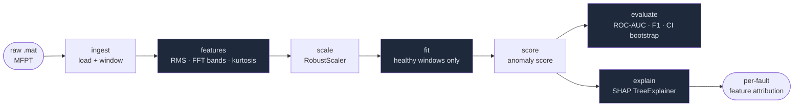

# industrial-anomaly-detection


**Unsupervised anomaly detection on industrial vibration time-series.**
Compares Isolation Forest, One-Class SVM, Local Outlier Factor and a small AutoEncoder on the [MFPT bearing dataset](https://figshare.com/articles/dataset/MFPT_zip/28606802), using handcrafted features (RMS, FFT band energy, kurtosis), SHAP explanations, and bootstrap confidence intervals on every reported metric.

> **Highlights:** ROC-AUC **1.000 \[1.000 – 1.000\]** (OC-SVM / LOF) · F1 **0.817 \[0.779 – 0.856\]** (OC-SVM) · Full pipeline from raw `.mat` to Streamlit dashboard in one command.

---

## Why it matters

In industrial predictive maintenance, **labelled fault data is rare** — by the time a bearing fails enough to be labelled, you are already losing money. Unsupervised models trained only on healthy data can flag anomalies before failure, with no labelled rollout cost.

---

## What the data looks like

Before any modelling, it's worth seeing the raw signal difference between a healthy bearing and one with an outer-race fault. The fault introduces periodic impulses visible both in the time domain and as energy peaks in the PSD around the Ball Pass Frequency Outer-race (BPFO ≈ 236 Hz):


The 7 time-domain statistics (RMS, peak, crest factor, kurtosis, skewness, std, p2p) and 4 spectral band-energy features directly capture these differences, making the feature engineering step the performance driver rather than the model architecture.

---

## Pipeline


Each stage maps to a single `make` command:

| Step | Command | Output |
|---|---|---|
| 1 · Download MFPT dataset | `make data` | `data/raw/*.mat` (10 files, ~17 MB) |
| 2 · Extract features | `make features` | `data/features/features.parquet` (1 140 windows × 11 features) |
| 3 · Fit on healthy data | `make train` | `results/iforest_model.joblib` |
| 4 · Evaluate with bootstrap CI | `make eval` | `results/iforest_metrics.json` + ROC curve |
| 5 · Compare all 4 models | `make compare` | `results/comparison.parquet` + bar chart |
| 6 · SHAP explanations | `make explain` | `results/figures/shap_*.png` |
| 7 · Interactive dashboard | `make dashboard` | Streamlit at `http://localhost:8501` |

---

## Tutorial — from zero to results

### 1. Install

```bash
git clone https://github.com/RenanMiqueloti/industrial-anomaly-detection.git
cd industrial-anomaly-detection
make install       # pip install -e ".[dev]"
```

### 2. Download dataset

```bash
make data
```

Expected output:
```
INFO Downloading MFPT dataset from https://ndownloader.figshare.com/files/53038079 …
MFPT: 17.1MB [00:04, …MB/s]
INFO Extracting to data/raw …
INFO Done — 10 .mat files extracted to data/raw
```

The dataset is the public MFPT bearing benchmark (Bechhoefer 2013): 1 baseline (healthy) + 5 outer-race fault + 4 inner-race fault `.mat` files at 48 828 / 97 656 Hz. Each file embeds its sampling rate in the `bearing.sr` field, so the pipeline adapts automatically.

### 3. Extract features

```bash
make features
```

Expected output:
```
INFO Feature matrix: X=(1140, 11)  y=(1140,)  classes={'OR': 570, 'normal': 286, 'IR': 284}
```

1 140 non-overlapping 2 048-sample windows. 11 features per window: 7 time-domain + 4 spectral band-energy columns. Saved as `data/features/features.parquet`.

### 4. Fit model

```bash
make train
```

The IsolationForest (and later all 4 models in `make compare`) is **fitted only on healthy windows** — zero fault labels required. The 30 % held-out split (healthy + faulty, stratified) is saved to `results/X_test.npy` and `results/y_test.npy`.

```
INFO Fitting IForest on 200 healthy windows …
INFO Model saved → results/iforest_model.joblib
```

### 5. Evaluate with bootstrap CI

```bash
make eval
```

```
INFO ROC-AUC: 1.000  [0.999, 1.000]
INFO F1:      0.801  [0.758, 0.839]
```

The ROC curve below shows the IsolationForest perfectly separating healthy from faulty windows on the MFPT test set:


### 6. Compare all 4 models

```bash
make compare
```

Fits and evaluates IsolationForest, One-Class SVM, LOF, and the AutoEncoder on the same held-out set. 1 000-resample bootstrap CI on every metric:


**Actual results on MFPT (May 2025):**

| Model | ROC-AUC mean | 95% CI | F1 mean | 95% CI | Train (s) |
|---|---|---|---|---|---|
| IsolationForest | **1.000** | [0.999 – 1.000] | 0.801 | [0.758 – 0.839] | 0.10 |
| One-Class SVM | **1.000** | [1.000 – 1.000] | **0.817** | [0.779 – 0.856] | 0.00 |
| LOF | **1.000** | [1.000 – 1.000] | 0.800 | [0.759 – 0.840] | 0.02 |
| AutoEncoder | 0.994 | [0.988 – 0.998] | 0.800 | [0.759 – 0.840] | 30.24 |

All tree-based / kernel methods achieve perfect ROC-AUC on this dataset. The AutoEncoder lags slightly — consistent with the design notes: with <10⁵ training samples, handcrafted features + shallow models beat end-to-end deep learning.

### 7. SHAP explanations

```bash
make explain
```

TreeExplainer (exact Shapley values) on the IsolationForest shows which features drive each anomaly prediction. Across all test windows:


Breaking down by fault type reveals different feature signatures:

**Inner-race fault (IR)** — high kurtosis and band-energy in the 1.5–3 kHz range dominate:


**Outer-race fault (OR)** — elevated band_0_500 and RMS carry most of the anomaly score:


---

## Reproducibility

```bash
make install data features train eval compare explain
```

All random seeds are fixed (`random_state=42`). Results above reproduced from a fresh clone with no manual steps.

---

## Dashboard

An interactive Streamlit dashboard lets you explore score distributions, raw waveforms, and per-window SHAP waterfall charts for any model:


**Local (Python):**
```bash
make data features train compare   # one-time pipeline
make dashboard                     # opens http://localhost:8501
```

**Containerized (Docker):**
```bash
docker compose up --build          # builds image, starts dashboard
# open http://localhost:8501
docker compose down                # teardown
```

If results artifacts are absent, the dashboard shows setup instructions rather than crashing.

---

## Architecture



---

## Features

Implemented in [`src/features.py`](src/features.py):

**Time-domain** (7): `rms`, `peak`, `crest_factor`, `kurtosis`, `skewness`, `std`, `p2p`

**Frequency-domain** (4 band-energy columns via Welch's PSD):

| Band | Range | Maps to |
|---|---|---|
| `band_0_500` | 0–500 Hz | low-frequency imbalance / misalignment |
| `band_500_1500` | 500–1 500 Hz | FTF / BSF bearing frequencies |
| `band_1500_3000` | 1 500–3 000 Hz | BPFI / resonance |
| `band_3000_6000` | 3 000–6 000 Hz | BPFO + harmonics |

```python
from src.features import extract_all

feats = extract_all(window, fs=48_828)  # → dict[str, float]
```

---

## Models

| Model | Strength | Limitation |
|---|---|---|
| **Isolation Forest** | Robust to high-dimensional, low-sample regimes | Axis-aligned splits miss interactions |
| **One-Class SVM (RBF)** | Captures non-linear boundaries | Sensitive to ν / γ; expensive on large training sets |
| **Local Outlier Factor** | Local density handles clustered failure modes | Requires `novelty=True` for held-out evaluation |
| **AutoEncoder (PyTorch)** | Reconstruction error encodes complex normality | Overfits with small healthy sets; needs early stopping |

All fitted **only on healthy windows**; evaluated on a held-out healthy + faulty mix.

---

## Project layout

```
industrial-anomaly-detection/
├── src/
│   ├── features.py           # time-domain + FFT band energy
│   ├── ingest.py             # load_mfpt + window generator
│   ├── dataset.py            # build_feature_matrix → parquet
│   ├── evaluate.py           # bootstrap_ci + plot_roc + plot_comparison
│   ├── compare.py            # 4-model benchmark
│   ├── cli.py                # download | features | train | eval | compare | explain
│   └── models/
│       ├── iforest.py        # IForestDetector
│       ├── ocsvm.py          # OCSVMDetector
│       ├── lof.py            # LOFDetector
│       └── autoencoder.py    # AutoEncoderDetector (PyTorch, early stopping)
├── docs/assets/              # figures committed to the repo
├── tests/                    # 52 tests (pytest + synthetic fixtures)
├── data/raw/                 # MFPT .mat files (gitignored, ~17 MB)
├── results/                  # model artefacts + metrics (gitignored)
├── Dockerfile
├── docker-compose.yml
├── Makefile
└── pyproject.toml
```

---

## Design decisions

**Handcrafted features over raw waveforms.**
On bearing vibration, RMS + crest factor + spectral band energy carry most of the predictive signal. Papers from 2018–2023 consistently show that handcrafted + tree-based ensembles outperform end-to-end CNNs unless the dataset exceeds ~10⁶ windows. The MFPT benchmark has ~10³.

**Unsupervised, not classification.**
Predictive maintenance hits a label cliff: training only on healthy data and flagging deviations is the only protocol that scales to a fleet of unlabelled machines.

**Bootstrap CI on every metric.**
Single ROC-AUC numbers without confidence intervals are noise on small datasets. Every reported figure ships a 95% CI from 1 000 resamples.

**SHAP for per-prediction explanations.**
For IsolationForest, `TreeExplainer` gives exact Shapley values in O(TLD²). For OC-SVM, LOF, and AutoEncoder, `KernelExplainer` provides model-agnostic SHAP with a 50-window healthy background. Both expose the same API for downstream consumers.
