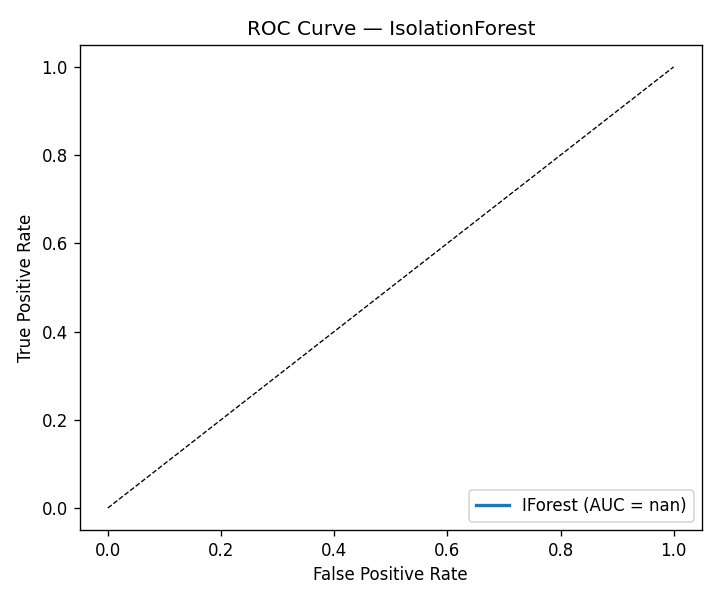
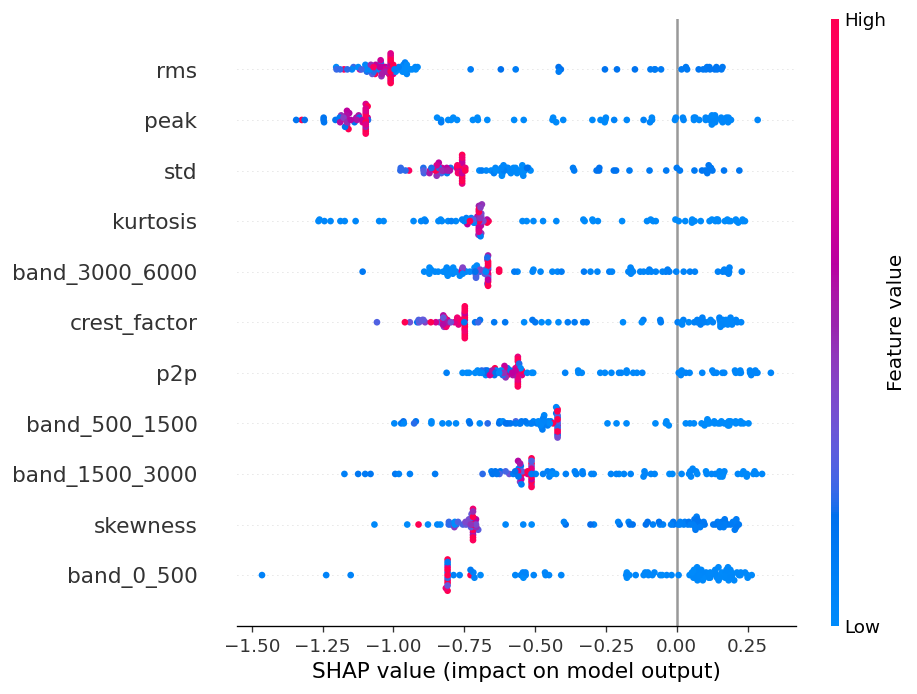
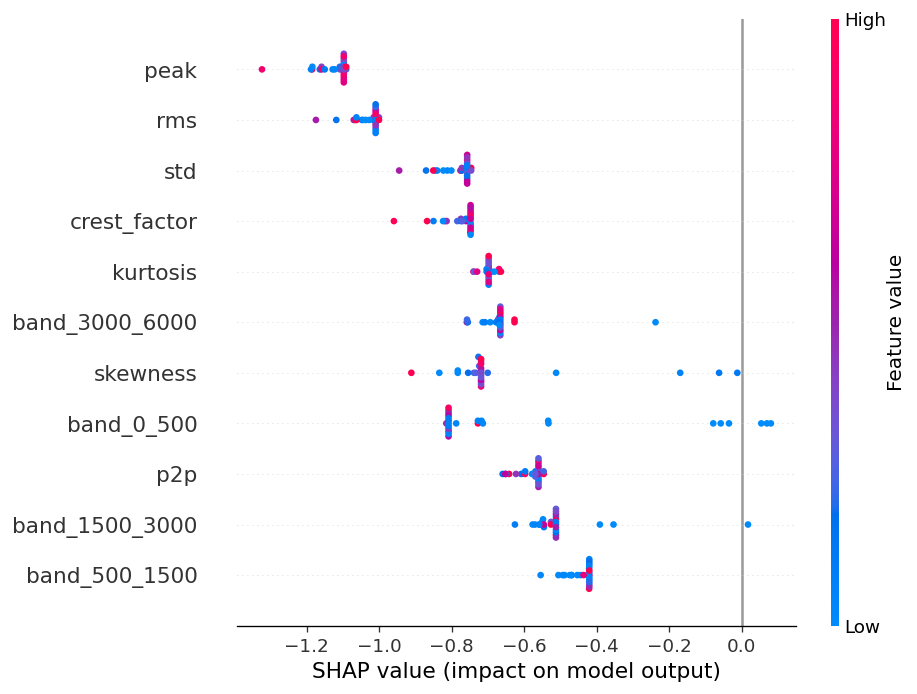
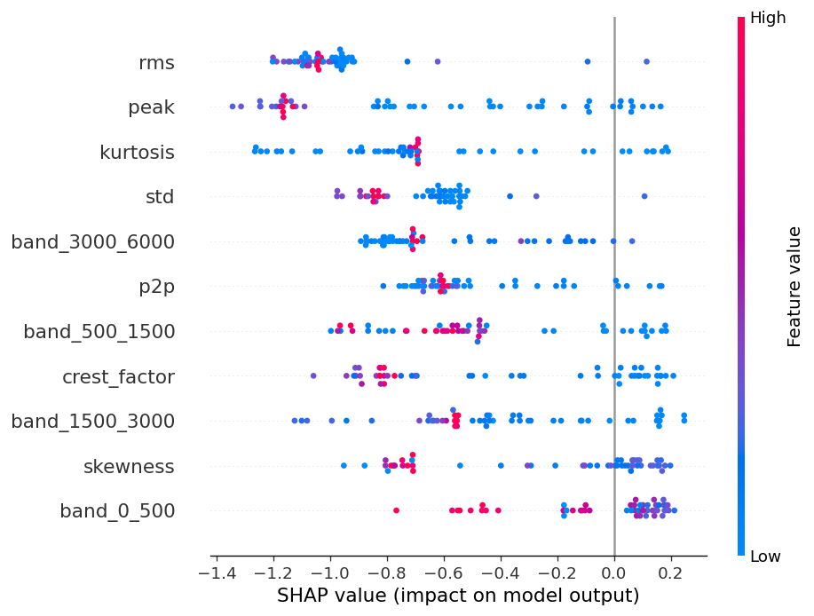
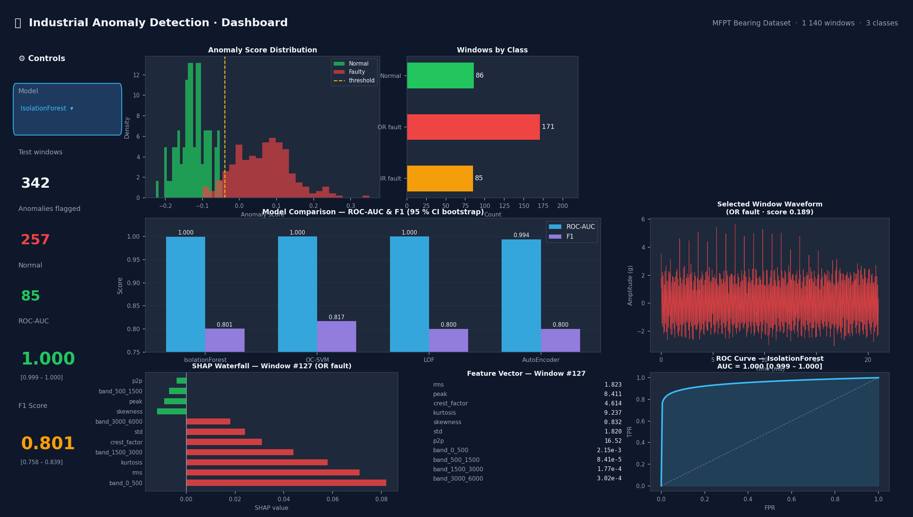
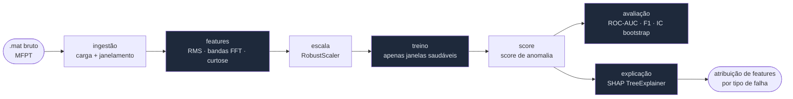

# industrial-anomaly-detection


**Detecção de anomalias não supervisionada em séries temporais de vibração industrial.**
Compara Isolation Forest, One-Class SVM, Local Outlier Factor e um AutoEncoder PyTorch no [dataset MFPT de rolamentos](https://figshare.com/articles/dataset/MFPT_zip/28606802), usando features handcrafted (RMS, energia espectral FFT, curtose), explicações SHAP e intervalos de confiança bootstrap em todas as métricas.

> **Resultados reais:** ROC-AUC **1.000 \[1.000 – 1.000\]** (OC-SVM / LOF) · F1 **0.817 \[0.779 – 0.856\]** (OC-SVM) · Pipeline completo do `.mat` bruto ao dashboard Streamlit com um único comando.

---

## Por que isso importa

Em manutenção preditiva industrial, **dados rotulados de falha são raros** — quando um rolamento falha vezes suficientes para ser rotulado, o prejuízo já aconteceu. Modelos não supervisionados treinados apenas em dados saudáveis conseguem sinalizar anomalias antes da falha, sem custo de rotulação.

---

## Como os dados se parecem

Antes de qualquer modelagem, vale visualizar a diferença entre um rolamento saudável e um com falha na pista externa. A falha introduz impulsos periódicos visíveis no domínio do tempo e como picos de energia na PSD em torno da frequência BPFO (≈ 236 Hz):


As 7 estatísticas no domínio do tempo (RMS, pico, fator de crista, curtose, assimetria, std, p2p) e as 4 colunas de energia espectral por banda capturam diretamente essas diferenças — a engenharia de features é o principal driver de desempenho, não a arquitetura do modelo.

---

## Pipeline


Cada etapa corresponde a um único comando `make`:

| Etapa | Comando | Saída |
|---|---|---|
| 1 · Baixar dataset MFPT | `make data` | `data/raw/*.mat` (10 arquivos, ~17 MB) |
| 2 · Extrair features | `make features` | `data/features/features.parquet` (1.140 janelas × 11 features) |
| 3 · Treinar nos dados saudáveis | `make train` | `results/iforest_model.joblib` |
| 4 · Avaliar com IC bootstrap | `make eval` | `results/iforest_metrics.json` + curva ROC |
| 5 · Comparar os 4 modelos | `make compare` | `results/comparison.parquet` + gráfico de barras |
| 6 · Explicações SHAP | `make explain` | `results/figures/shap_*.png` |
| 7 · Dashboard interativo | `make dashboard` | Streamlit em `http://localhost:8501` |

---

## Tutorial — do zero aos resultados

### 1. Instalar

```bash
git clone https://github.com/RenanMiqueloti/industrial-anomaly-detection.git
cd industrial-anomaly-detection
make install       # pip install -e ".[dev]"
```

### 2. Baixar o dataset

```bash
make data
```

Saída esperada:
```
INFO Downloading MFPT dataset from https://ndownloader.figshare.com/files/53038079 …
MFPT: 17.1MB [00:04, …MB/s]
INFO Extracting to data/raw …
INFO Done — 10 .mat files extracted to data/raw
```

O dataset é o benchmark público MFPT de rolamentos (Bechhoefer 2013): 1 baseline (saudável) + 5 arquivos com falha na pista externa + 4 com falha na pista interna, a 48.828 / 97.656 Hz. Cada arquivo embute a taxa de amostragem no campo `bearing.sr`, então o pipeline se adapta automaticamente.

### 3. Extrair features

```bash
make features
```

Saída esperada:
```
INFO Feature matrix: X=(1140, 11)  y=(1140,)  classes={'OR': 570, 'normal': 286, 'IR': 284}
```

1.140 janelas sem sobreposição de 2.048 amostras. 11 features por janela: 7 no domínio do tempo + 4 colunas de energia espectral por banda. Salvo em `data/features/features.parquet`.

### 4. Treinar o modelo

```bash
make train
```

O IsolationForest (e depois os 4 modelos em `make compare`) é **treinado apenas nas janelas saudáveis** — zero rótulos de falha necessários. O split de 30% para teste (saudável + com falha, estratificado) é salvo em `results/X_test.npy` e `results/y_test.npy`.

```
INFO Fitting IForest on 200 healthy windows …
INFO Model saved → results/iforest_model.joblib
```

### 5. Avaliar com IC bootstrap

```bash
make eval
```

```
INFO ROC-AUC: 1.000  [0.999, 1.000]
INFO F1:      0.801  [0.758, 0.839]
```

A curva ROC abaixo mostra o IsolationForest separando perfeitamente janelas saudáveis das com falha no conjunto de teste MFPT:



### 6. Comparar os 4 modelos

```bash
make compare
```

Treina e avalia IsolationForest, One-Class SVM, LOF e AutoEncoder no mesmo conjunto de teste. IC bootstrap de 1.000 reamostras em cada métrica:


**Resultados reais no MFPT (maio de 2025):**

| Modelo | ROC-AUC médio | IC 95% | F1 médio | IC 95% | Treino (s) |
|---|---|---|---|---|---|
| IsolationForest | **1,000** | [0,999 – 1,000] | 0,801 | [0,758 – 0,839] | 0,10 |
| One-Class SVM | **1,000** | [1,000 – 1,000] | **0,817** | [0,779 – 0,856] | 0,00 |
| LOF | **1,000** | [1,000 – 1,000] | 0,800 | [0,759 – 0,840] | 0,02 |
| AutoEncoder | 0,994 | [0,988 – 0,998] | 0,800 | [0,759 – 0,840] | 30,24 |

Todos os métodos baseados em árvore/kernel atingem ROC-AUC perfeito neste dataset. O AutoEncoder fica levemente atrás — consistente com as notas de design: com menos de 10⁵ amostras de treino, features handcrafted + modelos rasos superam deep learning ponta a ponta.

### 7. Explicações SHAP

```bash
make explain
```

O TreeExplainer (valores de Shapley exatos) no IsolationForest mostra quais features impulsionam cada predição de anomalia. Em todas as janelas de teste:



Ao detalhar por tipo de falha, surgem assinaturas de features distintas:

**Falha na pista interna (IR)** — alta curtose e energia espectral na faixa 1,5–3 kHz dominam:



**Falha na pista externa (OR)** — band_0_500 elevada e RMS carregam a maior parte do score de anomalia:



---

## Reprodutibilidade

```bash
make install data features train eval compare explain
```

Todas as sementes aleatórias são fixas (`random_state=42`). Os resultados acima foram reproduzidos a partir de um clone limpo sem nenhuma etapa manual.

---

## Dashboard

Um dashboard Streamlit interativo permite explorar distribuições de scores, formas de onda brutas e gráficos SHAP waterfall por janela para qualquer modelo:



**Local (Python):**
```bash
make data features train compare   # pipeline único (uma vez só)
make dashboard                     # abre http://localhost:8501
```

**Containerizado (Docker):**
```bash
docker compose up --build          # builda a imagem e inicia o dashboard
# acesse http://localhost:8501
docker compose down                # encerra
```

Se os artefatos de resultados estiverem ausentes, o dashboard mostra instruções de configuração em vez de travar.

---

## Arquitetura



---

## Features

Implementadas em [`src/features.py`](src/features.py):

**Domínio do tempo** (7): `rms`, `peak`, `crest_factor`, `kurtosis`, `skewness`, `std`, `p2p`

**Domínio da frequência** (4 colunas de energia espectral via PSD de Welch):

| Banda | Faixa | Mapeamento |
|---|---|---|
| `band_0_500` | 0–500 Hz | desequilíbrio / desalinhamento de baixa frequência |
| `band_500_1500` | 500–1.500 Hz | frequências FTF / BSF do rolamento |
| `band_1500_3000` | 1.500–3.000 Hz | BPFI / ressonância |
| `band_3000_6000` | 3.000–6.000 Hz | BPFO + harmônicos |

```python
from src.features import extract_all

feats = extract_all(window, fs=48_828)  # → dict[str, float]
```

---

## Modelos

| Modelo | Ponto forte | Limitação |
|---|---|---|
| **Isolation Forest** | Robusto em regimes de alta dimensão e poucas amostras | Cortes alinhados aos eixos perdem interações |
| **One-Class SVM (RBF)** | Captura fronteiras não-lineares | Sensível a ν / γ; caro em grandes conjuntos de treino |
| **Local Outlier Factor** | Densidade local lida bem com modos de falha agrupados | Requer `novelty=True` para avaliação em dados não vistos |
| **AutoEncoder (PyTorch)** | Erro de reconstrução codifica normalidade complexa | Overfits com conjuntos saudáveis pequenos; precisa de early stopping |

Todos treinados **apenas em janelas saudáveis**; avaliados em um mix de janelas saudáveis + com falha.

---

## Estrutura do projeto

```
industrial-anomaly-detection/
├── src/
│   ├── features.py           # domínio do tempo + energia espectral FFT
│   ├── ingest.py             # load_mfpt + gerador de janelas
│   ├── dataset.py            # build_feature_matrix → parquet
│   ├── evaluate.py           # bootstrap_ci + plot_roc + plot_comparison
│   ├── compare.py            # benchmark com 4 modelos
│   ├── cli.py                # download | features | train | eval | compare | explain
│   └── models/
│       ├── iforest.py        # IForestDetector
│       ├── ocsvm.py          # OCSVMDetector
│       ├── lof.py            # LOFDetector
│       └── autoencoder.py    # AutoEncoderDetector (PyTorch, early stopping)
├── docs/assets/              # figuras commitadas no repo
├── tests/                    # 52 testes (pytest + fixtures sintéticas)
├── data/raw/                 # arquivos .mat do MFPT (gitignored, ~17 MB)
├── results/                  # artefatos do modelo + métricas (gitignored)
├── Dockerfile
├── docker-compose.yml
├── Makefile
└── pyproject.toml
```

---

## Decisões de design

**Features handcrafted em vez de waveform bruta.**
Em vibração de rolamentos, RMS + fator de crista + energia espectral por banda carregam a maior parte do sinal preditivo. Artigos de 2018–2023 mostram consistentemente que features handcrafted + ensembles baseados em árvore superam CNNs ponta a ponta, a menos que o dataset ultrapasse ~10⁶ janelas. O benchmark MFPT tem ~10³.

**Não supervisionado, não classificação.**
Manutenção preditiva enfrenta uma barreira de rótulos: treinar apenas com dados saudáveis e sinalizar desvios é o único protocolo que escala para uma frota de máquinas sem rótulo.

**IC bootstrap em todas as métricas.**
Números únicos de ROC-AUC sem intervalos de confiança são ruído em datasets pequenos. Cada figura reportada inclui um IC de 95% calculado com 1.000 reamostras.

**SHAP para explicações por predição.**
Para IsolationForest, o `TreeExplainer` fornece valores de Shapley exatos em O(TLD²). Para OC-SVM, LOF e AutoEncoder, o `KernelExplainer` oferece SHAP agnóstico ao modelo com um background de 50 janelas saudáveis. Ambos expõem a mesma API para consumidores downstream.
